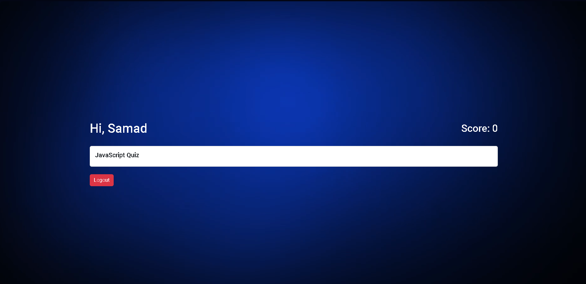

# Quiz App

A Quiz Application built with HTML, CSS, and JavaScript, featuring user and admin functionalities, dynamic question handling, and localStorage integration for question management.



## Features

- **User Signup/Login**: Secure authentication for users.
- **Admin Login**: Separate admin login for managing quizzes.
- **Question Handling**: Questions are stored in localStorage and shuffled for each quiz session.
- **Score Display**: Real-time score updates in the header.
- **Interactive Cards**: Cards that redirect to another page upon clicking and entering a key.

## Getting Started

### Prerequisites

- Web Browser (Chrome, Firefox, etc.)

### Installation

1. Clone the repository:
    ```bash
    git clone https://github.com/abdulsamad100/Quiz-App.git
    ```
2. Navigate to the project directory:
    ```bash
    cd Quiz-App
    ```
3. Open `index.html` in your web browser.

### Usage

1. **User Flow**:
    - Sign up or log in as a user.
    - Start the quiz, answer questions, and view your score in real-time.

2. **Admin Flow**:
    - Log in as an admin.
    - Add, edit, or delete quiz questions.

## Project Structure

- `index.html`: Main page for user signup/login.
- `admin.html`: Admin page for managing questions.
- `questions.html`: Page displaying the quiz questions.
- `allquiz.html`: Page showing all available quizzes.
- `app.js`: Main JavaScript file for handling user interactions.
- `admin.js`: JavaScript file for admin functionalities.
- `questions.js`: JavaScript file for quiz question logic.
- `style.css`: CSS file for styling the application.

## Contributing

1. Fork the repository.
2. Create your feature branch:
    ```bash
    git checkout -b feature/YourFeature
    ```
3. Commit your changes:
    ```bash
    git commit -m 'Add your feature'
    ```
4. Push to the branch:
    ```bash
    git push origin feature/YourFeature
    ```
5. Open a pull request.

## Contact

For any inquiries or feedback, please reach out to [samadjs100@gmail.com](mailto:samadjs100@gmail.com).